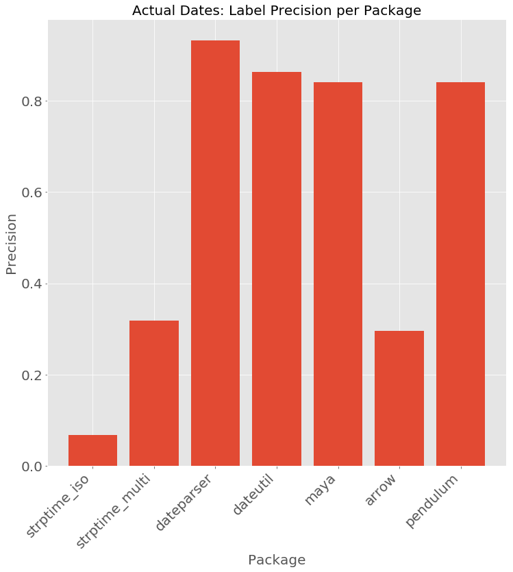
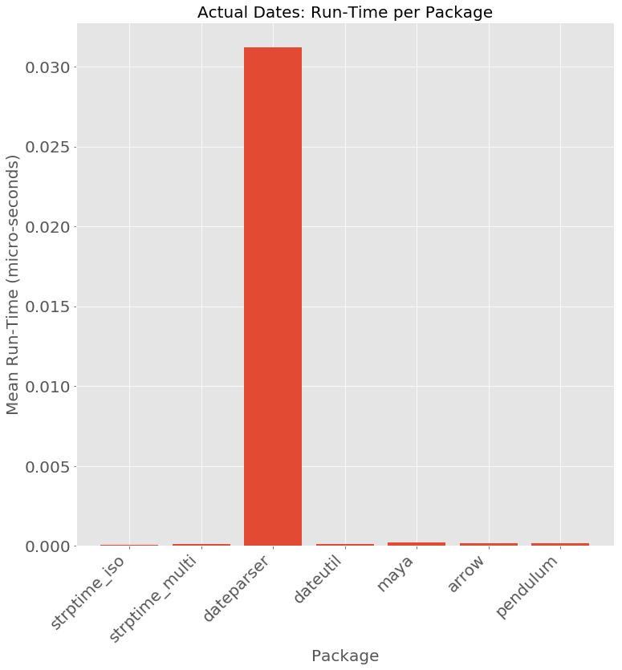
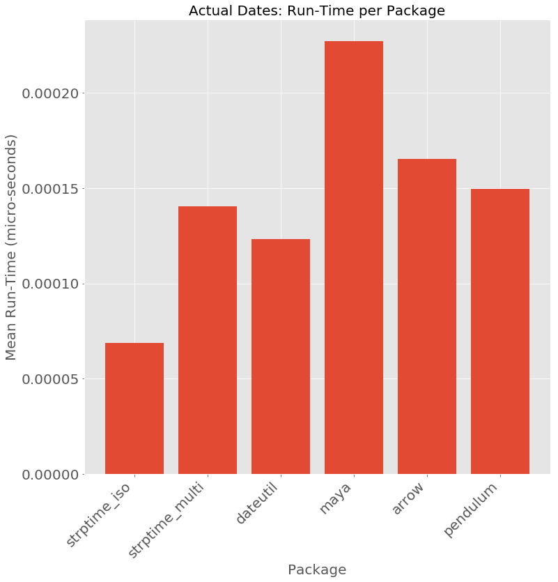
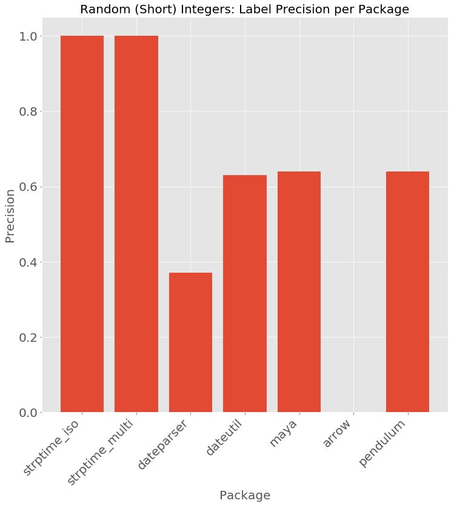
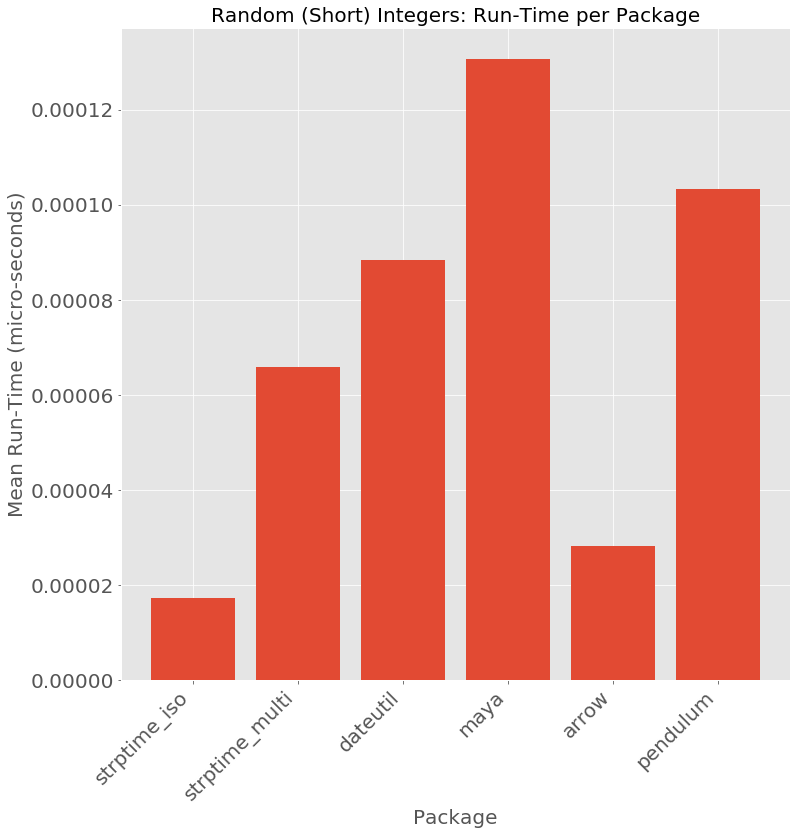
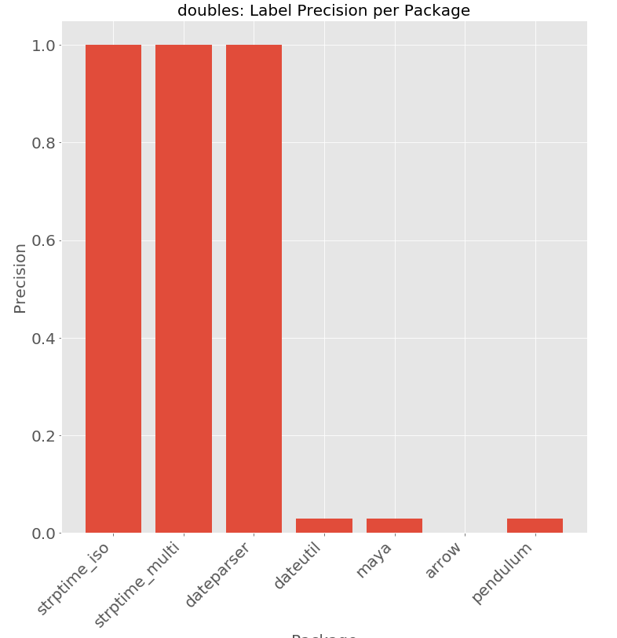
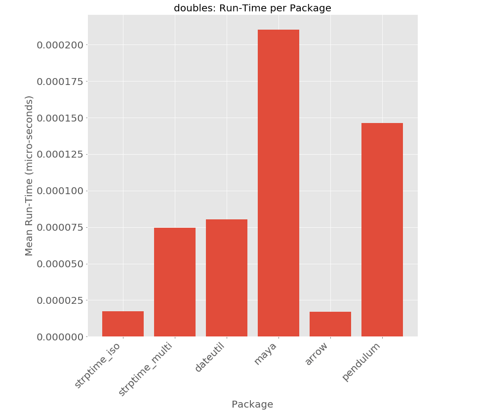

Long story short - I needed to do some parsing of dates encoded as strings in various formats.

* "08/30/1993"
* "Aug 30 1993"
* "August 30th 1993"
* "1993/08/30"
* "08-30-1993"
* etc

with the possibility that the string being parsed does not encode a date.

* "Bears"
* "More Bears"
* "3.14159"
* "112358"

This is a well tread problem and one full of subtleties, so it is natural to explore how well existing libraries do. My investigation was limited to Python, but with hindsight I am curious to discard the constraint of a fixed language. 

Digging a few pages into a Google search for "date parsing in Python" uncovers a variety of options and reading the package descriptions / origin story of each reveals yet more.

* [datetime](https://docs.python.org/2/library/datetime.html) from base Python.

* [dateutil](https://dateutil.readthedocs.io/en/stable/)

* [dateparser](https://dateparser.readthedocs.io/en/latest/#)

* [maya](https://github.com/kennethreitz/maya)

* [arrow](http://arrow.readthedocs.io/en/latest/)

* [pendulum](https://github.com/sdispater/pendulum)

With some of the most popular options on the table and a list that was getting a little long we stop there. For other fun scraping related things - [blog.scrapinghub](https://blog.scrapinghub.com) - was nice source. In addition I stumbled on this blog post comparing the speed of a subset of these [datetime vs Arrow vs Pendulum vs Delorean vs udatetime](https://aboutsimon.com/blog/2016/08/04/datetime-vs-Arrow-vs-Pendulum-vs-Delorean-vs-udatetime.html)

2 packages that did not make the cut for arbitrary reasons : 

* [parsedatetime](https://github.com/bear/parsedatetime)

* [babel](http://babel.pocoo.org/en/latest/api/dates.html)

Experiment Construction
==============================

To test the various packages I needed to define 

1. A common API across the packages.

2. Quality measures that are informed by how I will use the package (now and in the future).

3. Datasets used to generate these performance measures.

### A Common Syntax

* For each package I selected it's default parsing method such that it takes as input a string and returns a DateTime object or None if the string cannot be parsed to a DateTime. I converted the output of the parsing to a DateTime if that was not automatically handled by the package. I discarded timezone information, since it was not critical for my use case.

### Defining Quality

For each package I was interested in the following 3 measures

1. Precision : What percent of strings return the correct DateTime if the string does encode a date or return None if the string does not encode a date.

2. Recall : Of the strings that do encode dates - how many get parsed to the correct DateTime?

3. Runtime : What is the mean runtime per input string?

### Data Sets

To generate quality metrics we require testing data. I considered one dataset of actual dates encoded in various standard and non-standard ways and multiple datasets of random strings that were not intended to represent dates.

* A hand constructed list of string encodings of dates and associated true date.

* Random Shorts : Uniform random integers from -32767 to 32768

* Random Double : Uniform random doubles from 0.0 to 1.0

* Single characters [a-z] and [A-Z]

Experiment 0 : Actual Dates
====================================

The data is a hand generated list of various date formats I have observed in the wild, some formats and garblings that plausibly occur, and for each the associated standard ISO-8601 formatting.

* [Data](data/dates.csv)



Dateparser has the highest recall of the bunch. The gap between dateparser and the others would be even larger if the evaluation covered more languages or other specialties of dateparser. The only 3 dates that dateparser struggled with were

* ```20110101 -> 1010-02-01 01:00:00```       : ISO-8601 order without delimiters
* ```Januaty 1 2011 -> None```                : A Mispelling
* ```First Friday of January 2011 -> None```  : Purposefully tricky

maya / pendulum and dateutil have comparable performance with the same 6 unsurprising
errors.

* ```2011|01|01 -> None```
* ```2011_01_01 -> None```
* ```Januaty 1 2011 -> None```
* ```First Friday of January 2011 -> None```
* ```2011/25/06 -> None```
* ```２０１１年１月１日 -> None``` 

maya and pendulum though give a surprising result 

* ```2011-1-1 -> 2011-11-01```

While it is not apparent that Arrow is designed for high recall - it performs similar
to multiple passes of datetime.strptime with different patterns. 



There is definitely a cost for dateparser's performance - requiring roughly 100 times
the time per input string.



Filtering out that outlier to zoom in - we find that amongst medium recall dateutil has
the best performance.

Experiment 1 : Random Short Integers
=====================================

After the preliminary tests strings that did encode dates and the exciting results from
dateparser - I delved into tests on performance on non-date strings.
The first example of such garbage inputs is random integers from -32767 to 32768.

```python
def generate_test_short_data(sample_size = 100):
    return [(str(random.randint(-32767, 32768)), None, "Random Short") for i in range(sample_size)]
```



Perhaps unsurprisingly the parsers that are more flexible and have higher recall
have a higher tendency of parsing random input data as a date. This leads to a 
*large* drops in precision for dateparser, dateutil, maya, and pendulum. dateutil / 
maya / pendulum share the same errors parsing 4 digit integers as years. Dateparser
parses both 4 digit integers as YYYY and when feasible parses 5 digit integers as MDYYH or
MDDYY. The precision numbers for dateutil / maya / pendulum are entirely determined by
the range of values considered, since for under 10000 the string gets parsed as a year
and over 10000 is not parsed to a date.

Example False Positives for dateparser
--------------------------------------
 * ```-4656 -> 4656-10-22 00:00:00```
 * ```9094 -> 9094-10-22 00:00:00```
 * ```20641 -> 2041-02-06 00:00:00```
 * ```10363 -> 2063-10-03 00:00:00```
 * ```7394 -> 7394-10-22 00:00:00```

Example False Positives for dateutil / maya / pendulum
------------------------------------------------------
 * ```-4656 -> 4656-10-22 00:00:00```
 * ```9094 -> 9094-10-22 00:00:00```
 * ```7394 -> 7394-10-22 00:00:00```
 * ```-925 -> 0925-10-22 00:00:00```
 * ```5371 -> 5371-10-22 00:00:00```

Example False Positives for arrow
---------------------------------
 * ```-4656 -> 1969-12-31 22:42:24```
 * ```9094 -> 1970-01-01 02:31:34```
 * ```-17267 -> 1969-12-31 19:12:13```
 * ```-20830 -> 1969-12-31 18:12:50```
 * ```20641 -> 1970-01-01 05:44:01```



Dataparser clocked in at 0.16 microseconds per string - which is roughly 5x the run-time as the date strings above and up to 1000 times larger than the other packages.

Experiment 1.1 : Digging Deeper
================================

dateparser has a range of behaviors on integers depending on the size of the input.
From 1-100 it looks to try parsing as a month, then a day, then year 19xx or 20xx where
the other fields are filled in using the current time. From 100 to 1000 it parses as
a time of day. From 1000 to 10000 it parses the full integer as a year. Beyond 10000 it
jumps into the behavior mentioned above.

Experiment 2 : Single Characters
================================

The second trivial experiment 

![Single Characters [A-Z][a-z] : Precision](images/char_prec.png)

Most packages nail random strings. There are many single characters though that dateparser maps to a datetime. I expect these derive from shorthand for days of the week (English : M,T,W,..) in other langauges.

Example False Positives for dateparser
--------------------------------------
 * ```a -> 2017-01-09 00:00:00```
 * ```d -> 2017-10-08 00:00:00```
 * ```h -> 2017-10-09 00:00:00```
 * ```j -> 2017-10-05 00:00:00```
 * ```k -> 2017-10-03 00:00:00```
 * ```l -> 2017-10-02 00:00:00```
 * ```m -> 2017-10-09 00:00:00```
 * ```s -> 2017-10-07 00:00:00```
 * ```v -> 2017-10-06 00:00:00```
 * ```A -> 2017-01-09 00:00:00```

![Single Characters [A-Z][a-z] : Run-Time 2](images/char_time.png)

Experiment 3 : Random Doubles
==============================

```python
def generate_test_double_data(sample_size = 100):
    return [(str(100.0 * np.random.rand()), None, "Random Double") for i in range(sample_size)]
```



Example False Positives for dateutil / maya / pendulum
--------------------------------------

 * ```37.18858554492067 -> 2037-10-09 00:00:00```
 * ```90.58570851440683 -> 1990-10-09 00:00:00```
 * ```89.55455036895947 -> 1989-10-09 00:00:00```
 * ```99.18829981896567 -> 1999-10-09 00:00:00```
 * ```63.12637119966145 -> 2063-10-09 00:00:00```

 Example False Positives for arrow
 --------------------------------------
 * ```30.628229006528297 -> 1970-01-01 00:00:30.628229```
 * ```51.9091657471709 -> 1970-01-01 00:00:51.909166```
 * ```21.439205229372703 -> 1970-01-01 00:00:21.439205```
 * ```78.72487521117215 -> 1970-01-01 00:01:18.724875```
 * ```84.81257902971872 -> 1970-01-01 00:01:24.812579```



Summary
================

The best tool depends heavily on the job. In this case it depends on your degree of certainty that the strings you are parsing are truly dates and the cost if you are wrong.

If recall is your top priority (or if you can guarantee each string *does* represent a data) and time is not critical -> dateparser.

If there is only a handful of formats that you can infer at the start -> strptime.

dateutil / maya / pendulum are in the middle ground where you need to be flexible to different formats but there may be non-date strings. These have very similar precision and run-time, but dateutil is often a little bit faster and more correct.

For my purposes - I will be using dateutil wrapped with a check for whether the string can be cast as a float.